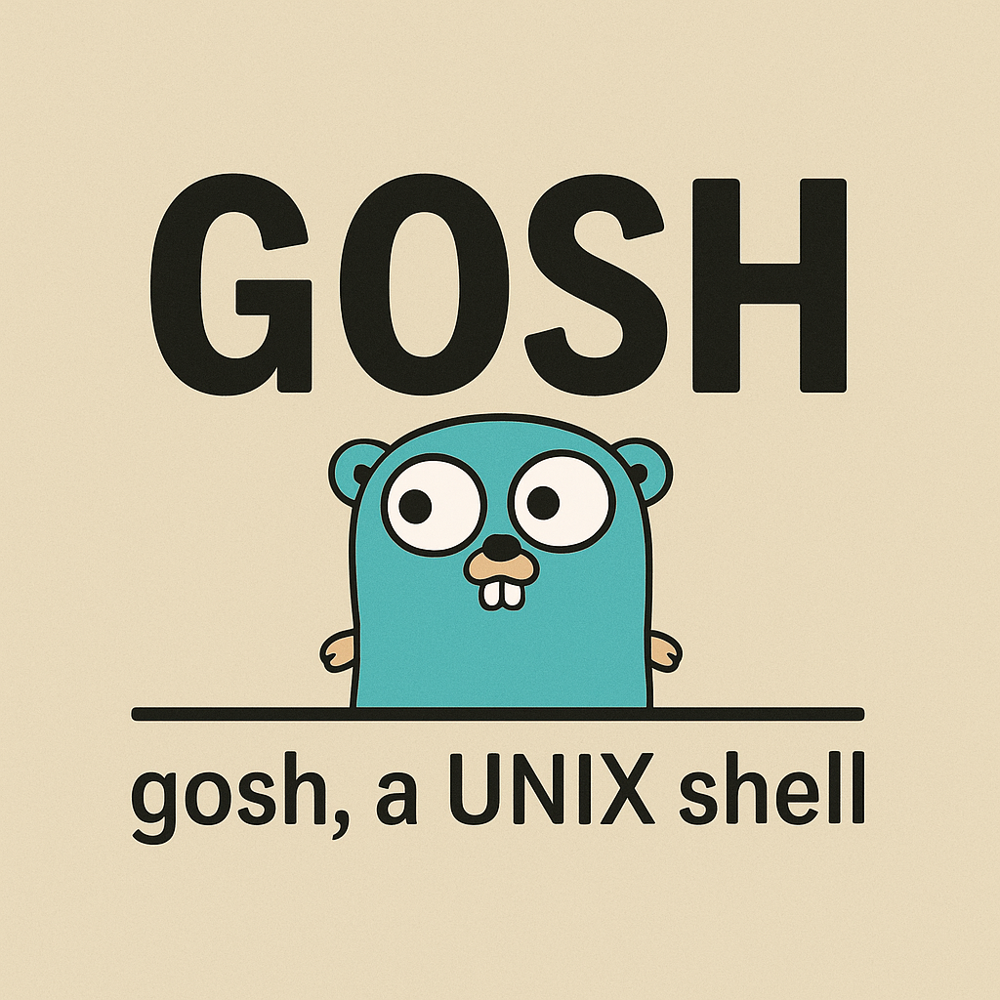

# gosh - A Simple Shell



A basic command-line shell written in Go with sh-style scripting support, designed for macOS compatibility. Gosh, it's good to have a reliable shell!

## Features

### Built-in Commands
Gosh provides a comprehensive set of built-in commands for shell operations. See the [Command Reference](doc/command_reference.md) for detailed documentation of all available commands.

### Shell Features
- **Interactive Mode**: Run `./gosh` for an interactive shell session
- **Command Mode**: Run `./gosh -c "command"` to execute a single command and exit
- **Script Mode**: Run `./gosh script.sh` to execute shell scripts
- **Control Structures**: If statements and case statements supported in both interactive and script modes
- **Functions**: Define and use shell functions with positional parameters
- **Command Chaining**: Execute multiple commands sequentially with `;`
- **Unix Pipes**: Connect commands with `|` to chain operations
- **Input/Output Redirection**: Support for `<`, `>`, and `>>` operators
- **Background Execution**: Run commands in background with `&`
- **Line Continuation**: Split long commands across multiple lines using `\`
- **Environment Variables**: Set and use custom environment variables
- **Command Aliases**: Create shortcuts for frequently used commands
- **Command History**: Track previously executed commands
- **Quote Handling**: Support for single and double quotes in arguments
- **Comment Support**: Lines starting with `#` are treated as comments in scripts
- **Variable Expansion**: Expand environment variables with `$VAR` and `${VAR}` syntax
- **Command Substitution**: Execute commands and use their output with `$(command)` and `` `command` ``
- **Tilde Expansion**: Expand `~` to home directory and user paths
- **Glob Patterns**: Use wildcards for filename matching

For detailed information on scripting and advanced features, see the [Scripting Guide](doc/scripting_guide.md) and [Advanced Topics](doc/advanced_topics.md).

## Documentation

- [Tab Completion Test Guide](doc/tab_completion.md) - Test and verify tab completion features
- [Command Reference](doc/command_reference.md) - List of all built-in commands and their usage
- [Scripting Guide](doc/scripting_guide.md) - Learn how to write shell scripts using gosh
- [Advanced Topics](doc/advanced_topics.md) - Explore more advanced features and techniques

## Building

```bash
go build -o gosh
```

## Usage

### Interactive Mode
```bash
./gosh
```
Gosh, that was easy!

### Command Mode
```bash
./gosh -c "command"
```
Execute a single command and exit. Perfect for automation and scripting!

Examples:
```bash
./gosh -c "echo 'Hello World'"
./gosh -c "ls -la | grep .go"
./gosh -c "pwd; echo 'Current directory listed above'"
./gosh -c "ls; echo 'Files listed'; pwd"
```

### Script Mode
```bash
./gosh script.sh
```
By gosh, scripting has never been simpler!

### Example Script
```bash
#!/usr/bin/env gosh
# Example gosh script - gosh, this is neat!

echo "Hello from gosh!"
pwd
export MY_VAR=test
echo "MY_VAR is: $MY_VAR"

# Local variables (shell-only)
local TEMP_VAR="temporary value"
echo "TEMP_VAR is: $TEMP_VAR"

# Pipe examples - gosh, pipes are powerful!
echo "testing pipe functionality" | wc -w
ls -la | head -5
cat /etc/passwd | grep root | wc -l

# Gosh darn it, that's some fine scripting!
```

## Quick Examples

```bash
# Basic usage
ls -la
echo "Hello, World!"

# Pipes and redirection
ls | grep ".go" > go_files.txt
echo "Hello" >> output.txt

# Variables and expansion
export MY_VAR="Hello"          # Environment variable
local TEMP_VAR="temporary"     # Local variable (shell-only)
echo "$MY_VAR, $(whoami)!"
echo "Temp: $TEMP_VAR"

# Command chaining
echo "Starting..."; pwd; echo "Done!"

# Line continuation for long commands
echo "This is a very long command" \
  "that spans multiple lines" \
  "for better readability"
```

For comprehensive examples and tutorials, see the [Scripting Guide](doc/scripting_guide.md).

## Architecture

Gosh is organized into multiple modules for maximum readability and maintainability. For detailed architecture information, see the [Advanced Topics](doc/advanced_topics.md) documentation.

## Compatibility

Designed and tested for macOS. Gosh, the shell uses Go's standard library for cross-platform compatibility where possible - oh my gosh, it's portable!

## License

This project is open source and available under the MIT License.